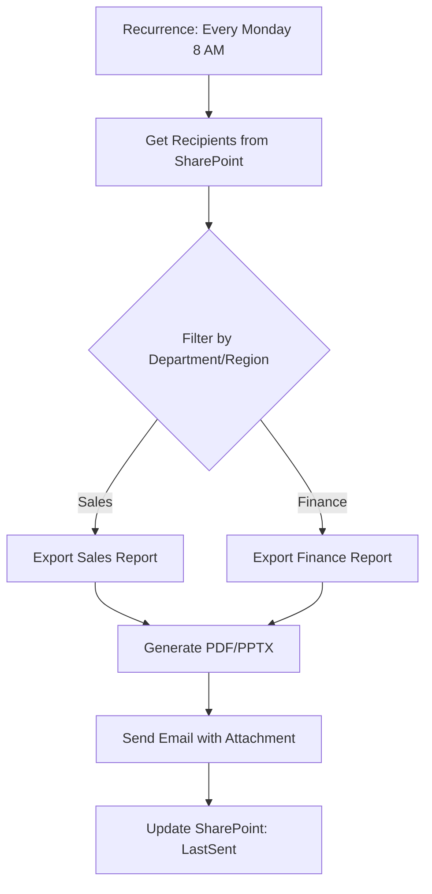

# Power-Automate

### 1. **Automated Report Subscription with Dynamic Recipients**  
   - **Scenario**: Instead of manually sharing reports, automatically email Power BI reports to different stakeholders based on conditions (e.g., region, department).  
   - **How?**  
     - Use **Power Automate + Power BI API** to trigger emails when a report is refreshed.  
     - Fetch recipient list from **SharePoint/Excel** and filter dynamically.  
     - Attach PDF/PNG exports of the report.  

### 2. **Alert-Based Report Trigger for Anomalies**  
   - **Scenario**: Get notified when a KPI in Power BI crosses a threshold (e.g., sales drop by 20%).  
   - **How?**  
     - Use **Power BI’s "Alert" feature** to detect anomalies.  
     - Trigger a **Power Automate flow** to:  
       - Send an email/SMS via **Twilio**.  
       - Log the issue in a **SharePoint List** or **Teams channel**.  

### 3. **Auto-Refresh Power BI Dataset on File Upload**  
   - **Scenario**: When a new CSV/Excel file is uploaded to **OneDrive/SharePoint**, automatically refresh the Power BI dataset.  
   - **How?**  
     - Set up a **"When a file is created"** trigger in Power Automate.  
     - Use the **Power BI API** to refresh the dataset.  
     - Optional: Send a confirmation email.  

### 4. **Dynamic Report Comments & Feedback Loop**  
   - **Scenario**: Let users submit feedback on Power BI reports via **Microsoft Forms** and log responses in a dashboard.  
   - **How?**  
     - Create a **Microsoft Form** for feedback.  
     - Use Power Automate to:  
       - Capture responses.  
       - Append them to a **Power BI dataset (Excel/SharePoint)**.  
       - Auto-reply with a thank-you email.  

### 5. **Automated Approval Workflow for Report Changes**  
   - **Scenario**: Require manager approval before publishing changes to a Power BI report.  
   - **How?**  
     - Trigger a flow when a **Power BI report is modified** (via API or scheduled check).  
     - Send an **approval request via Teams/Email**.  
     - If approved, publish changes; if rejected, notify the author.  

### **Side Quest**:  
- **Auto-Archive Old Reports**: Use Power Automate to move unused Power BI reports to an archive folder after X days of inactivity.

---
# **Enhanced Automated Power BI Report Subscription System**

Here's a **more robust, production-ready** version of the automated report distribution system with improved error handling, personalization, and security.

## **🚀 Key Improvements Over Basic Version**
1. **Proper Power BI API authentication** (service principal)
2. **Error handling & retry logic**
3. **Personalized email content with dynamic report links**
4. **Logging & audit trail**
5. **Conditional logic for different report types**
6. **Support for multiple formats (PDF, PPTX, PNG)**

---

## **🔧 Step 1: Advanced Recipient Data Setup**
### **Use SharePoint List with Enhanced Columns**
| Column | Type | Purpose |
|--------|------|---------|
| Email | Single line | Recipient email |
| Name | Single line | For personalization |
| Department | Choice | Sales/Finance/HR |
| Region | Choice | Filtering logic |
| ReportType | Choice | "Sales" or "Finance" report |
| LastSent | Date | Audit tracking |

**Power Automate will:**
✅ Filter by department/region  
✅ Track when reports were last sent  
✅ Personalize emails with recipient's name  

---

## **⚡ Step 2: Power Automate Flow (Enhanced)**
### **1. Trigger: Scheduled (Weekly) or Power BI Dataset Refresh**


### **2. Power BI Authentication (Service Principal)**
**No more manual tokens!**  
```json
// HTTP Action - Get Access Token
Method: POST
URI: https://login.microsoftonline.com/{tenant-id}/oauth2/v2.0/token
Headers:
  Content-Type: application/x-www-form-urlencoded
Body:
  client_id=xxxx&client_secret=xxxx&scope=https://analysis.windows.net/powerbi/api/.default&grant_type=client_credentials
```

### **3. Export Report with Error Handling**
```json
// HTTP Action - Export Report
Method: POST
URI: https://api.powerbi.com/v1.0/myorg/groups/{workspace-id}/reports/{report-id}/ExportTo
Headers:
  Authorization: Bearer <token-from-step1>
Body:
  {
    "format": "PDF",
    "powerBIReportConfiguration": {
      "reportLevelFilters": [
        {"filter": "Region eq 'North'"} // Dynamic filter!
      ]
    }
  }
```

**➕ Add these steps after export:**
- **Check export status** (polling with Do Until)
- **Timeout after 5 minutes**
- **Retry 3 times on failure**

---

## **✉️ Step 3: Smart Email Delivery**
### **Personalized Email Template**
```html
Subject: [Department] Report - [Date]

Hi [Name],

Your weekly [ReportType] report is attached. 

📊 View interactive version: [Power BI Report Link]
📅 Last updated: [LastRefreshTime]

Regards,
Automation Team
```

**Attachments:**
- Main report (PDF)
- Optional PPTX for executives
- Regional PNG snapshot

---

## **📊 Step 4: Logging & Audit**
### **1. Success/Failure Tracking**
- **Update SharePoint** with:
  - LastSent datetime
  - Status ("Success"/"Failed")
  - Error messages (if any)

### **2. Error Notifications**
- **Teams message** to admin channel on failures
- **Retry logic** for transient errors

---

## **🔒 Security Best Practices**
1. **Use Azure Key Vault** for:
   - Power BI client secrets
   - SharePoint credentials
2. **Restrict permissions** with:
   - Power BI service principal
   - SharePoint limited access
3. **GDPR compliance** - Mask emails in logs

---

## **💡 Pro Tips**
1. **Add a "Unsubscribe" link** in emails
2. **Support multiple languages** based on region
3. **Version attachments** (e.g., "Sales_Report_20240520.pdf")
4. **Throttle API calls** to avoid Power BI limits

---

## **📜 Alternative Without APIs**
If APIs are too complex:
1. **Power Automate Desktop** to:
   - Log into Power BI manually
   - Export reports via UI
   - Save to OneDrive
2. **Cloud flow** picks up files and emails them

---

## **🚨 Troubleshooting Guide**
| Issue | Solution |
|-------|----------|
| 403 API errors | Check service principal permissions |
| Empty exports | Verify report-level filters |
| Email blocked | Use approved distribution lists |
| Slow performance | Optimize Power BI report first |

---

**Would you like me to:**
1. Provide exact HTTP action configurations?
2. Share a sample SharePoint list structure?
3. Explain the service principal setup in detail?
4. Create a simplified non-API version?

This enhanced version is ready for enterprise deployment with proper monitoring and security. Let me know which part you'd like to explore deeper! 🛠️
